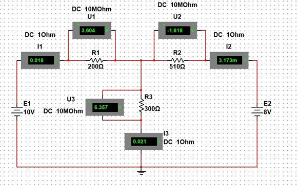
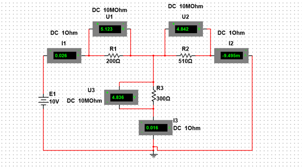
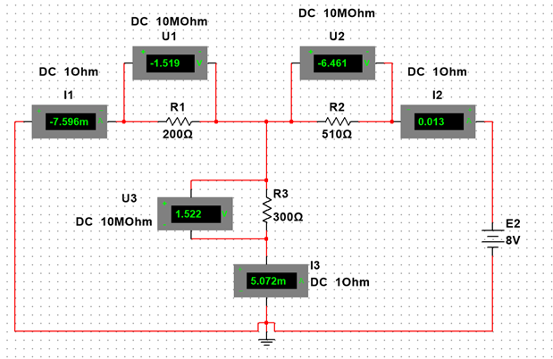

# 东南大学电工电子实验中心

## 实 验 报 告

### 课程名称： <u>电路实验</u>

### 第 2 次实验

#### 实验名称：<u>应用Multisim软件工具设计电路验证网络定理</u>

院 （系）：电子科学与工程学院 专业：电子科学与技术

姓 名： <u>zhz</u> 学 号： <u>06024436</u>

实 验 室: <u>403室</u> 实验组别：

同组人员： 实验时间：<u>2025年11 月14日</u>

评定成绩： 审阅教师：xxx

---

### 一、实验目的

（1）通过实验加深对参考方向、基尔霍夫定理、叠加定理、戴维南定理的理解；
（2）Multisim 软件入门：元器件配置、电路连接、电路参数测试；
（3）通过学习对实验结果的分析对比，了解虚拟仿真与实物实验的差异。

---

### 二、实验原理

1. 基尔霍夫定理：
   - 电流定理（KCL）:任意时刻，流进和流出电路中节点的电流的代数和等于零。
   - 电压定理（KVL）:在任何一个闭合回路中，所有的电压升或降之和等于零。

2. 叠加定理：
   - 在线性电路中，任一支路的电流或电压等于电路中每一个独立源单独作用时在该支路所产生的电流或电压的代数和。

3. 戴维南定理：
   - 任何复杂的线性有源一端口网络都可以用一个电压源和一个等效电阻的串联来等效。电压源的电压端口的开路电压，而电阻等于端口的全部独立电源置零后的输入电阻。

4. 二极管特性：
   - 二极管的主要特性：单向导电性。当阳极电压高于阴极时电流通过，二极管导通；当阴极电压高于阳极时电流截止。
   - 伏安特性：正向呈指数上升反向几乎为零，直到击穿点。

---

### 三、实验内容

#### 1、基尔霍夫定理、叠加定理的验证

##### （1）按图1所示实验电路建立电路。用电压表和电流表测量各电阻两端电压和各支路电流。分析说明测量结果。

**表1 测量数据**

| 状态        | U1（V）  | U2（V）  | U3（V） | I1（A）   | I2（A）   | I3（A）  |
| :-------- | :----- | :----- | :---- | :------ | :------ | :----- |
| E1、E2同时作用 | 3.604  | -1.618 | 6.357 | 0.018   | 3.173m  | 0.021  |
| E1单独作用    | 5.123  | 4.842  | 4.836 | 0.026   | -9.495m | 0.016  |
| E2单独作用    | -1.519 | -6.461 | 1.522 | -7.596m | 0.013   | 5.072m |
| 叠加计算结果    | 3.604  | -1.619 | 6.358 | 0.018   | 3.505m  | 0.021  |

**实验结果分析：**

实验电路中因电流表电压表内阻的微小影响产生了微小的误差，三个仿真电路中KCL和KVL均成立，各条支路的叠加电压电流测量结果基本符合叠加定理，验证了叠加定理。

##### （2）将300Ω电阻改成1N4009的二极管（正极连接到A点上），自行建立表格，记录测量数据，计算测量结果并分析说明。

**表2 测量数据**

| 状态             | U1（V） | U2（V） | U3（V） | I1（A） | I2（A）   | I3（A） |
| :--------------- | :------ | :------ | :------ | :------ | :-------- | :------ |
| E1、E2同时作用   | 8.962   | -6.993  | 0.935   | 0.045   | 0.014     | 0.059   |
| E1单独作用       | 9.044   | 0.909   | 0.867   | 0.045   | -1.781m   | 0.043   |
| E2单独作用       | -0.707  | -7.275  | 0.700   | -3.535m | 0.014     | 0.011   |
| 叠加计算结果     | 8.337   | -6.366  | 1.567   | 0.041   | 0.012     | 0.054   |

**实验结果分析：**

本实验在将R3更换为二极管后，在三个仿真电路中，各节点电压、电流符合基尔霍夫定律；叠加计算值与实际同时加电结果数值上误差保持在7%左右，U3的数值误差较大。二极管属于非线性元件，理论上叠加定理不成立，本实验中其在三种情况下均保持正向导通，使电路较好的拟合为线性电路，因此在本实验中数值上叠加定理基本成立。

#### 2、设计电路，验证戴维南定理

##### （1）开路电压测量仿真电路

断开R3, 测量A、B端口电压为开路电压Uoc：

测量得到开路电压Uoc=9.435 V

##### （2）短路电流测量仿真电路

短路R3, 测量A、B端口的短路电流：

测量得到短路电流为Isc=0.065 A

##### （3）建立等效电路，验证戴维南定理。

**表3 测量数据**

| Uoc（V） | Isc（A） | Ro（Ω）计算值 | I3（A） |
| :------- | :------- | :------------ | :------ |
| 9.435    | 0.065    | 145.154       | 0.021   |

**实验结果分析：**

本实验通过开路电压Uoc和短路电流Isc的测量，计算得戴维南等效电阻Ro≈145.154Ω，并构建了等效电路。将等效电路与原负载连接后测得的电流与原电路完全一致，验证了戴维南定理的正确性。实验误差较小，说明仿真连接正确、测量方法合理。

---

### 四、实验使用仪器设备（使用软件）

**Multisim 14.3**

---

### 五、实验总结

**实验误差分析：**

1. 实验中使用的电流表内阻设为 1Ω、电压表为 10MΩ。在实际测量中，电流表串联会改变支路电流大小，电压表并联会造成轻微分流，特别是在小电流（mA级）时，1Ω 内阻对电流影响明显。造成叠加结果与理论结果在 I2、I3上出现毫安级差异，因为短路支路中串入了 1Ω 的表内阻使戴维南短路电流Isc稍低于理论值。
2. 在线性电阻网络中叠加定理电压、电流不完全重合的原因：小误差来自仪表内阻不完全理想。在二极管网络中，二极管为非线性元件，叠加定理理论上不成立。

**实验中出现的问题及解决方法：**

1. 电流读数为负值：检查电表极性，修正电表方向，使大多数读数满足正值。
2. 仪表无读数：发现电路中未连接公共地线，增补上地线。

**思考题：**

分析实验过程中测量值出现负值的原因。

实验中出现电压或电流为负值的主要原因是测量参考方向与实际电路中电压、电流方向不一致。负号来自参考方向的差异，并不影响电压、电流大小本身的正确性。

**收获体会：**

通过这次实验，我对基尔霍夫定理、叠加定理和戴维南定理有了更深刻的理解。自己动手在Multisim中搭建电路、观察电压电流的变化，让我明白了参考方向、仪表内阻以及二极管非线性对测量结果的影响。在叠加和戴维南验证中，我体会到理论条件与实际仿真之间仍存在差异，需要结合元件状态来判断是否适用。实验过程中熟悉了Multisim的使用方法，提高了我分析电路的能力。总体来说，这次实验加深了我对基础电路理论的理解，也让我意识到细心操作和合理分析的重要性。

---

### 六、参考资料

1. 东南大学电工电子实验中心，《电路实验教学计划（2025秋学期）（九龙湖）1》
2. 邱关源，《电路第六版》（高等教育出版社）------ 电路模型与电路定律相关内容。

