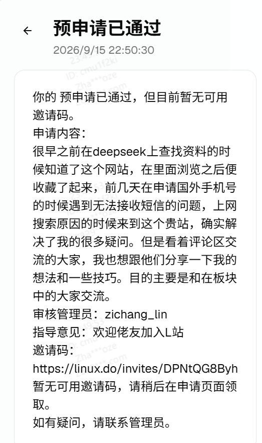
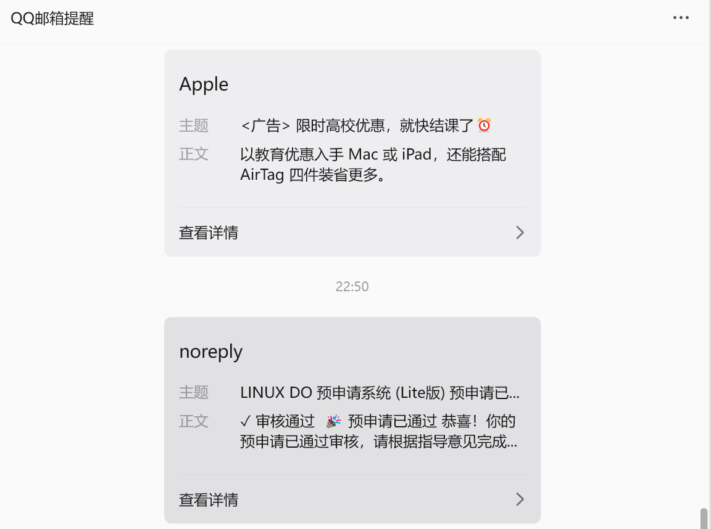

# 文章内容

一直听说 LINUX DO 是个技术氛围很好的地方，最近便想着去注册一个账号看看。

结果去了解了一下申请规则，心凉了半截——常规申请要求 GitHub 账号注册满 5 年。看了看自己那个才建了两年多的 GitHub 主页，只能默默关掉页面。当时确实有点失落，感觉硬性门槛就把自己挡在门外了。

后来不甘心又去翻论坛的帖子，发现社区其实还有个[预申请系统 | 预申请系统](https://pre.anglergap.org/zh/dashboard/pre-application)，也就是大家俗称的“年轻版”，专门给 GitHub 年限不够的用户准备的通道。于是抱着试一试的心态，认真填写了申请，之后就进入了等待。

这里想给想申请的小白朋友一个建议就是认真写明自己是从哪来，想要来这个社区做什么事情即可，感情真挚管理员一般会通过的。

今天晚上，手机突然弹出 QQ 邮箱的提醒。点开一看，是来自 `noreply` 的邮件：
> ✓ 审核通过 🎉 预申请已通过 恭喜！你的预申请已通过审核，请根据指导意见完成...

看到“审核通过”那几个字的时候，心里还是挺高兴的。连忙按照邮件里的指引完成了注册流程。
## 新手教程与年轻版的限制
进站第一件事当然是过新手教程。跟着流程走完，收到了 `@discobot` 的消息，还发了一张专属的证书。

不过，申请通过是一回事，年轻版的限制确实是存在的。在论坛里逛了逛才发现，因为走的是预申请通道，账号在初期有很多权限受限。比如一些热门板块（像“资源荟萃”之类的）可能进不去，或者只能看不能回，另外信任等级的提升也会比较慢。
其实这也完全能理解，毕竟社区要控制质量，防范小号和水军。对我这种 GitHub 年限不够的人来说，能有个“先上车”的机会已经很感激了。
接下来的日子，大概率就是老老实实潜水，多看看大佬们的开发调优帖。遵守社区规则，慢慢攒信任等级。
能进来就好。Hello, LINUX DO。