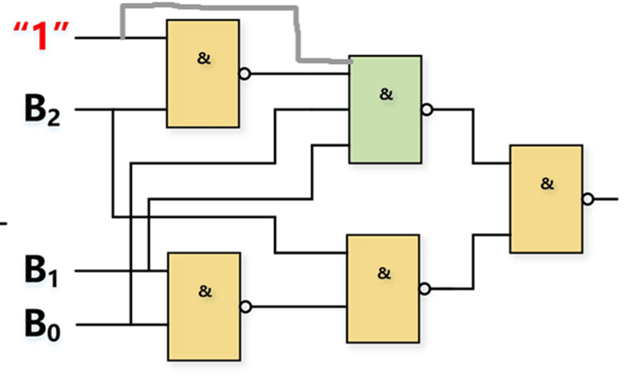
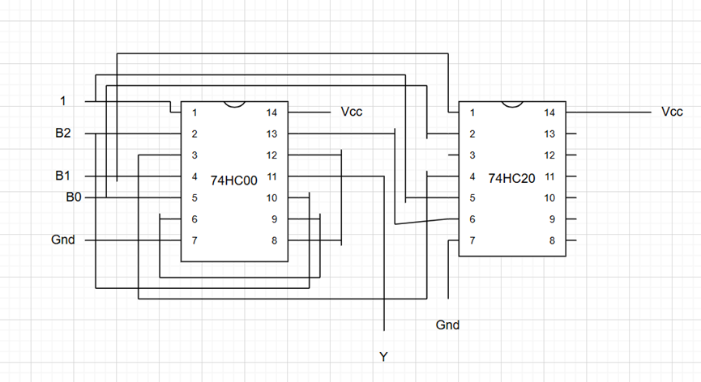
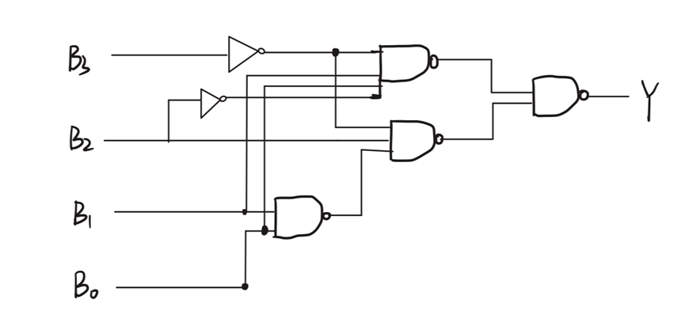
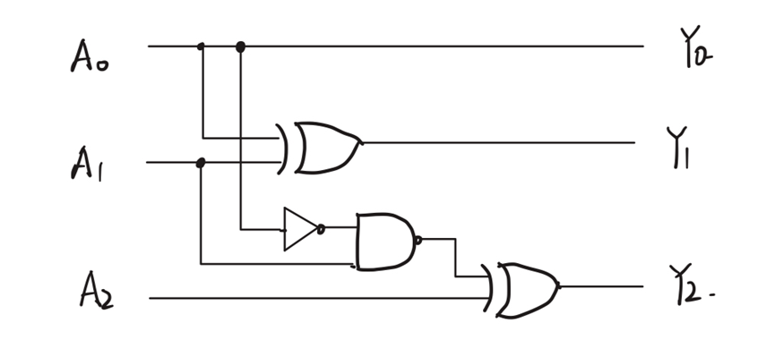
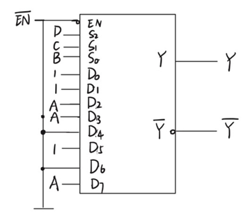

# 实验一 组合逻辑电路

姓名：zhz 
实验日期：2025年11月6日

## 实验目的

1. 认识数字集成电路，能识别各种类型的数字器件和封装
2. 掌握小规模组合逻辑和逻辑函数的工程设计方法
3. 掌握常用中规模组合逻辑器件的功能和使用方法
4. 学习查找器件资料，通过器件手册了解器件
5. 了解面包板的基本结构、掌握面包板连接电路的基本方法和要求
6. 了解实验箱的基本结构，掌握实验箱电源、逻辑开关和LED电平指示的用法
7. 学习基本的数字电路的故障检查和排除方法

## 实验内容1：数值判别电路

### 实验仪器

- 数字逻辑电路实验箱及其外设装置---供电、脉冲、边沿和时钟
- 集成芯片：74HC20（双4输入与非门）、74HC00（四2输入与非门）、74HC04（六反相器）
- 外围设备：逻辑电平开关、LED指示灯、导线若干

### 实验设计方案(a)

#### 1. 真值表

| B3 | B2 | B1 | B0 | Y |
|----|----|----|----|---|
| 0  | 0  | 0  | 0  | 0 |
| 0  | 0  | 0  | 1  | 0 |
| 0  | 0  | 1  | 0  | 0 |
| 0  | 0  | 1  | 1  | 1 |
| 0  | 1  | 0  | 0  | 1 |
| 0  | 1  | 0  | 1  | 1 |
| 0  | 1  | 1  | 0  | 1 |
| 0  | 1  | 1  | 1  | 0 |
| 1  | 0  | 0  | 0  | 0 |
| 1  | 0  | 0  | 1  | 0 |
| 1  | 0  | 1  | 0  | X |
| 1  | 0  | 1  | 1  | X |
| 1  | 1  | 0  | 0  | X |
| 1  | 1  | 0  | 1  | X |
| 1  | 1  | 1  | 0  | X |
| 1  | 1  | 1  | 1  | X |

#### 2. 卡诺图

| B3B2\B1B0 | 00 | 01 | 11 | 10 |
|-----------|----|----|----|----|
| 00        | 0  | 0  | 1  | 0  |
| 01        | 1  | 1  | 0  | 1  |
| 11        | X  | X  | X  | X  |
| 10        | 0  | 0  | X  | X  |

#### 3. 逻辑化简

逻辑表达式：  
Y = B̅₃B₂ + B̅₃B₁B̅₀  
= B̅₃(B₂ + B₁B̅₀)  
= B̅₃(B₂ + B₁)(B₂ + B̅₀)

由于要求只使用与非门和非门，需要将上述表达式转换为与非-与非形式。

#### 4. 逻辑电路图

#### 5. 硬件连接图

#### 6. 实验过程

搭建好电路并进行测试，按照真值表顺序从第一组测到第十组的过程中发现前7组结果正常，第8组理论应输出低电平，实际却输出高电平，继续测试发现后面几组测试结果均正确，经过故障排查发现电路地线接错地方，接到电源的负极输出端。将地线接GND之后重新测试一遍发现电路输出结果正常。

#### 7. 测试方案

| B3 | B2 | B1 | B0 | Y | 测试结果 |
|----|----|----|----|---|----------|
| 0  | 0  | 0  | 0  | 0 | 0        |
| 0  | 0  | 0  | 1  | 0 | 0        |
| 0  | 0  | 1  | 0  | 0 | 0        |
| 0  | 0  | 1  | 1  | 1 | 1        |
| 0  | 1  | 0  | 0  | 1 | 1        |
| 0  | 1  | 0  | 1  | 1 | 1        |
| 0  | 1  | 1  | 0  | 1 | 1        |
| 0  | 1  | 1  | 1  | 0 | 0        |
| 1  | 0  | 0  | 0  | 0 | 0        |
| 1  | 0  | 0  | 1  | 0 | 0        |

#### 8. 实验分析

1. 基于真值表绘制卡诺图并化简，得到逻辑表达式后，转换为与非-与非形式，仅使用与非门和非门完成电路设计
2. 硬件连接采用74HC20和74HC00芯片，通过实验箱的逻辑电平开关输入信号，LED指示灯显示输出
3. 测试遍历所有有效输入组合，输出结果与理论真值表完全一致，电路功能实现正常

### 实验设计方案（b）

#### 1. 真值表

| B3 | B2 | B1 | B0 | Y |
|----|----|----|----|---|
| 0  | 0  | 0  | 0  | 0 |
| 0  | 0  | 0  | 1  | 0 |
| 0  | 0  | 1  | 0  | 0 |
| 0  | 0  | 1  | 1  | 1 |
| 0  | 1  | 0  | 0  | 1 |
| 0  | 1  | 0  | 1  | 1 |
| 0  | 1  | 1  | 0  | 1 |
| 0  | 1  | 1  | 1  | 0 |
| 1  | 0  | 0  | 0  | 0 |
| 1  | 0  | 0  | 1  | 0 |
| 1  | 0  | 1  | 0  | 0 |
| 1  | 0  | 1  | 1  | 0 |
| 1  | 1  | 0  | 0  | 0 |
| 1  | 1  | 0  | 1  | 0 |
| 1  | 1  | 1  | 0  | 0 |
| 1  | 1  | 1  | 1  | 0 |

#### 2. 卡诺图

| B3B2\B1B0 | 00 | 01 | 11 | 10 |
|-----------|----|----|----|----|
| 00        | 0  | 0  | 1  | 0  |
| 01        | 1  | 1  | 0  | 1  |
| 11        | 0  | 0  | 0  | 0  |
| 10        | 0  | 0  | 0  | 0  |

#### 3. 逻辑化简

逻辑表达式：  
Y = B̅₃B₂B̅₁B̅₀ + B̅₃B₂B̅₁B₀ + B̅₃B₂B₁B̅₀ + B̅₃B̅₂B₁B₀  
= B̅₃B₂(B̅₁B̅₀ + B̅₁B₀ + B₁B̅₀) + B̅₃B̅₂B₁B₀

#### 4. 逻辑电路图

#### 5. 实验过程

测试前对照逻辑电路图，再次确认74HC系列门电路的引脚定义例如74HC00的输入输出引脚、电源与接地引脚，并检查实验箱的逻辑电平开关、LED指示灯模块是否正常供电。整理所需导线，按信号流向（输入→芯片→输出）规划导线连接路径，避免导线交叉缠绕影响后续排查。

#### 6. 测试方案

| B3 | B2 | B1 | B0 | Y | 测试结果 |
|----|----|----|----|---|----------|
| 0  | 0  | 0  | 0  | 0 | 0        |
| 0  | 0  | 0  | 1  | 0 | 0        |
| 0  | 0  | 1  | 0  | 0 | 0        |
| 0  | 0  | 1  | 1  | 1 | 1        |
| 0  | 1  | 0  | 0  | 1 | 1        |
| 0  | 1  | 0  | 1  | 1 | 1        |
| 0  | 1  | 1  | 0  | 1 | 1        |
| 0  | 1  | 1  | 1  | 0 | 0        |
| 1  | 0  | 0  | 0  | 0 | 0        |
| 1  | 0  | 0  | 1  | 0 | 0        |
| 1  | 0  | 1  | 0  | 0 | 0        |
| 1  | 0  | 1  | 1  | 0 | 0        |
| 1  | 1  | 0  | 0  | 0 | 0        |
| 1  | 1  | 0  | 1  | 0 | 0        |
| 1  | 1  | 1  | 0  | 0 | 0        |
| 1  | 1  | 1  | 1  | 0 | 0        |

#### 7. 实验小结

依据"数值大于2且小于7"的需求构建真值表，无无关项，所有16种输入组合均有明确输出状态。通过卡诺图化简得到逻辑表达式，采用门电路搭建逻辑电路，输入输出连接方式与方案a部分一致。测试覆盖全部16种输入组合，LED显示结果与理论输出完全匹配，电路满足设计要求。

## 实验内容2：3位二进制原码转补码电路

### 实验仪器

- 数字逻辑电路实验箱及其外设装置---供电、脉冲、边沿和时钟
- 集成芯片：74HC86（四2输入异或门）、74HC00（四2输入与非门）、74HC04（六反相器）、74HC151(8选一数据选择器)、74HC138(3线-8线译码器)
- 外围设备：逻辑电平开关、LED指示灯（3个）、导线若干

### 实验设计方案（a）

#### 1. 真值表

| 输入(原码)   | 输出(补码)   |
| -------- | -------- |
| A₂ A₁ A₀ | Y₂ Y₁ Y₀ |
| 0 0 0    | 0 0 0    |
| 0 0 1    | 1 1 1    |
| 0 1 0    | 1 1 0    |
| 0 1 1    | 1 0 1    |
| 1 0 0    | 1 0 0    |
| 1 0 1    | 0 1 1    |
| 1 1 0    | 0 1 0    |
| 1 1 1    | 0 0 1    |

#### 2. 卡诺图

Y₂卡诺图：

| A₂\A₁A₀ | 00  | 01  | 11  | 10  |
| ------- | --- | --- | --- | --- |
| 0       | 0   | 1   | 1   | 1   |
| 1       | 1   | 0   | 0   | 0   |

Y₁卡诺图：

| A₂\A₁A₀ | 00  | 01  | 11  | 10  |
| ------- | --- | --- | --- | --- |
| 0       | 0   | 1   | 0   | 1   |
| 1       | 0   | 1   | 0   | 1   |

Y₀卡诺图：

| A₂\A₁A₀ | 00  | 01  | 11  | 10  |
| ------- | --- | --- | --- | --- |
| 0       | 0   | 1   | 1   | 0   |
| 1       | 0   | 1   | 1   | 0   |

#### 3. 逻辑表达式

Y₂ = A̅₂A₁ + A̅₂A₀ + A̅₂A₀A̅₁ = A₂ ⊕ (A̅₁A̅₀)  
Y₁ = A₁ ⊕ A₀  
Y₀ = A₀

#### 4. 逻辑电路图

#### 5. 验证结果表格

| 测试序号 | 输入A₂A₁A₀ | 理论输出Y₂Y₁Y₀ | 实际输出Y₂Y₁Y₀ | 结果 |
|----------|------------|----------------|----------------|------|
| 1        | 000        | 000            | 000            | 符合 |
| 2        | 001        | 111            | 111            | 符合 |
| 3        | 010        | 110            | 110            | 符合 |
| 4        | 011        | 101            | 101            | 符合 |
| 5        | 100        | 100            | 100            | 符合 |
| 6        | 101        | 011            | 011            | 符合 |
| 7        | 110        | 010            | 010            | 符合 |
| 8        | 111        | 001            | 001            | 符合 |

#### 6. 实验分析

硬件连接通过实验箱逻辑电平开关输入原码，3个LED指示灯分别显示补码的三位输出。测试遍历所有8种输入组合，实际输出与理论补码完全一致，所有测试结果均符合要求，电路功能准确实现。

### 实验设计方案（b）

#### 1. 逻辑表达式

Y₀ = A₀  
Y₁ = A₁ ⊕ A₀  
Y₂ = Σm(1,2,3,4)

#### 2. 逻辑电路图

#### 3. 硬件连接图

#### 4. 实验过程

整理所需导线，按信号流向（输入→芯片→输出）规划导线连接路径，避免导线交叉缠绕影响后续排查。搭建电路时，先将74HC芯片插入实验箱的IC插座，确保芯片引脚与插座完全贴合，无虚接情况。连接电路后测试得出测试结果。

#### 5. 验证结果表格

| 测试序号 | 输入A₂A₁A₀ | 理论输出Y₂Y₁Y₀ | 实际输出Y₂Y₁Y₀ | 结果 |
|----------|------------|----------------|----------------|------|
| 1        | 000        | 000            | 000            | 符合 |
| 2        | 001        | 111            | 111            | 符合 |
| 3        | 010        | 110            | 110            | 符合 |
| 4        | 011        | 101            | 101            | 符合 |
| 5        | 100        | 100            | 100            | 符合 |
| 6        | 101        | 011            | 011            | 符合 |
| 7        | 110        | 010            | 010            | 符合 |
| 8        | 111        | 001            | 001            | 符合 |

#### 6. 实验分析

本实验题目中Y1的输出可用与非门来搭建，相比较两种方法都很省芯片省跳线。和老师沟通之后得知数据选择器一般和与非门来搭配使用，以后的搭建过程中如无特殊要求我会优先选择与非门的使用。

### 实验设计方案（c）

#### 1. 逻辑表达式

Y₀ = A₀  
Y₁ = A₁ ⊕ A₀ = (A₁A̅₀ + A̅₁A₀)  
Y₂ = A̅₂A₁ + A̅₂A₀ + A̅₂A₀A̅₁ = (A̅₂A₁ + A̅₂A₀A̅₁)

#### 2. 逻辑电路图

#### 3. 硬件连接图

#### 4. 实验过程

按照逻辑电路图搭建好电路之后，按照3位二进制数真值表的顺序依次调节逻辑电平开关，设置输入组合。每设置一组输入，观察LED指示灯的亮灭状态，并立即记录结果。

#### 5. 验证结果表格

| 测试序号 | 输入A₂A₁A₀ | 理论输出Y₂Y₁Y₀ | 实际输出Y₂Y₁Y₀ | 结果 |
|----------|------------|----------------|----------------|------|
| 1        | 000        | 000            | 000            | 符合 |
| 2        | 001        | 111            | 111            | 符合 |
| 3        | 010        | 110            | 110            | 符合 |
| 4        | 011        | 101            | 101            | 符合 |
| 5        | 100        | 100            | 100            | 符合 |
| 6        | 101        | 011            | 011            | 符合 |
| 7        | 110        | 010            | 010            | 符合 |
| 8        | 111        | 001            | 001            | 符合 |

#### 6. 实验小结

本实验使用三种方法设计三位源码转补码的电路，通过三种电路的设计，我深刻理解到电路设计的灵活性与科学性，在设计电路的过程中，应善于从不同角度看待问题，从而选择更简洁更方便的方法，三种设计方案中，我学会了很多74系列芯片的使用方法，也从不同角度理解了电路的灵活性，对我以后的设计有很大的帮助。

## 实验内容3：血型配对电路

### 实验器材

- 数据选择器（74HC151）1片
- 逻辑电平开关（4个，对应输入D、C、B、A）
- LED指示灯（1个，对应输出Y）
- 实验面包板、导线若干

### 实验设计方案

#### 1. 真值表

| D | C | B | A | Y |
|---|---|---|---|---|
| 0 | 0 | 0 | 0 | 1 |
| 0 | 0 | 0 | 1 | 1 |
| 0 | 0 | 1 | 0 | 1 |
| 0 | 0 | 1 | 1 | 1 |
| 0 | 1 | 0 | 0 | 0 |
| 0 | 1 | 0 | 1 | 1 |
| 0 | 1 | 1 | 0 | 0 |
| 0 | 1 | 1 | 1 | 1 |
| 1 | 0 | 0 | 0 | 0 |
| 1 | 0 | 0 | 1 | 0 |
| 1 | 0 | 1 | 0 | 1 |
| 1 | 0 | 1 | 1 | 1 |
| 1 | 1 | 0 | 0 | 0 |
| 1 | 1 | 0 | 1 | 0 |
| 1 | 1 | 1 | 0 | 0 |
| 1 | 1 | 1 | 1 | 1 |

#### 2. 卡诺图

| DC\BA | 00 | 01 | 11 | 10 |
|-------|----|----|----|----|
| 00    | 1  | 1  | 1  | 1  |
| 01    | 0  | 1  | 1  | 0  |
| 11    | 0  | 0  | 1  | 0  |
| 10    | 0  | 0  | 1  | 1  |

#### 3. 逻辑化简

逻辑表达式：  
Y = D̅C̅ + D̅BA + DCBA + D̅C̅B̅A̅

#### 4. 逻辑电路图

#### 5. 硬件连接图

#### 6. 实验过程

1. **电源连接**：将芯片的Vcc和GND分别连接到直流电源的对应端，为芯片供电
2. **芯片放置**：将74HC151（数据选择器）插入面包板，确保引脚与电源、地正确连接
3. **输入电路连接**：将4个逻辑电平开关分别连接到数据选择器的地址端（D→A₂、C→A₁、B→A₀）和数据端（A），作为输入信号源
4. **逻辑门连接**：根据化简后的逻辑，用与非门构建辅助逻辑电路，连接到数据选择器的输入引脚（如D₀~D₇）
5. **输出电路连接**：将数据选择器的输出端Y连接到LED指示灯

#### 7. 测试方案

| D | C | B | A | Y | 测试结果 |
|---|---|---|---|---|---|
| 0 | 0 | 0 | 0 | 1 | 1        |
| 0 | 0 | 0 | 1 | 1 | 1        |
| 0 | 0 | 1 | 0 | 1 | 1        |
| 0 | 0 | 1 | 1 | 1 | 1        |
| 0 | 1 | 0 | 0 | 0 | 0        |
| 0 | 1 | 0 | 1 | 1 | 1        |
| 0 | 1 | 1 | 0 | 0 | 0        |
| 0 | 1 | 1 | 1 | 1 | 1        |
| 1 | 0 | 0 | 0 | 0 | 0        |
| 1 | 0 | 0 | 1 | 0 | 0        |
| 1 | 0 | 1 | 0 | 1 | 1        |
| 1 | 0 | 1 | 1 | 1 | 1        |
| 1 | 1 | 0 | 0 | 0 | 0        |
| 1 | 1 | 0 | 1 | 0 | 0        |
| 1 | 1 | 1 | 0 | 0 | 0        |
| 1 | 1 | 1 | 1 | 1 | 1        |

#### 8. 实验分析

调试方案：当输入为O型输血给任意血型（D=0、C=0，B、A任意）时，LED应点亮；当输入为A型输血给A型、AB型（D=0、C=1，B=0、A=1或B=1、A=1）时，LED应点亮；当输入为B型输血给B型、AB型（D=1、C=0，B=1、A=0或B=1、A=1）时，LED应点亮；当输入为AB型输血给AB型（D=1、C=1，B=1、A=1）时，LED应点亮；其他非法组合时，LED应熄灭。

结果分析：根据结果表格，对应真值表发现电路测试结果正确。

## 实验内容4：保险箱数字密码锁（选做）

### 实验器材

- 74HC00芯片(2片)、74HC20（1片）
- 逻辑电平开关（4个，对应输入A3、A2、A1、A0）
- LED指示灯（1个，对应输出Y）
- 实验面包板、导线若干

### 实验设计方案

#### 1. 真值表

| E | A3 | A2 | A1 | A0 | Z1 | Z2 |
|---|---|---|---|---|---|---|
| 0 | X  | X  | X  | X  | 0  | 0  |
| 1 | 0  | 0  | 0  | 0  | 0  | 1  |
| 1 | 0  | 0  | 0  | 1  | 0  | 1  |
| 1 | 0  | 0  | 1  | 0  | 0  | 1  |
| 1 | 0  | 0  | 1  | 1  | 0  | 1  |
| 1 | 0  | 1  | 0  | 0  | 0  | 1  |
| 1 | 0  | 1  | 0  | 1  | 0  | 1  |
| 1 | 0  | 1  | 1  | 0  | 0  | 1  |
| 1 | 0  | 1  | 1  | 1  | 0  | 1  |
| 1 | 1  | 0  | 0  | 0  | 0  | 1  |
| 1 | 1  | 0  | 0  | 1  | 0  | 1  |
| 1 | 1  | 0  | 1  | 0  | 0  | 1  |
| 1 | 1  | 0  | 1  | 1  | 1  | 0  |
| 1 | 1  | 1  | 0  | 0  | 0  | 1  |
| 1 | 1  | 1  | 0  | 1  | 0  | 1  |
| 1 | 1  | 1  | 1  | 0  | 0  | 1  |
| 1 | 1  | 1  | 1  | 1  | 0  | 1  |

#### 2. 逻辑表达式

Z1 = E·A3·A̅₂·A1·A0  
Z2 = E·(A̅₃ + A₂ + A̅₁ + A̅₀)

#### 3. 逻辑电路图

#### 4. 硬件连接图

#### 5. 实验过程

使用4个输入信号，通过实验箱上的逻辑电平开关实现；1个输出端连接到实验箱上的LED指示灯。按照真值表要求，拨动逻辑电平开关以改变输入信号的值，遍历所有输入组合，观察并记录输出信号的值。

#### 6. 测试结果

| E | A3 | A2 | A1 | A0 | Z1 | Z2 |
|---|---|---|---|---|---|---|
| 0 | X  | X  | X  | X  | 0  | 0  |
| 1 | 0  | 0  | 0  | 0  | 0  | 1  |
| 1 | 0  | 0  | 0  | 1  | 0  | 1  |
| 1 | 0  | 0  | 1  | 0  | 0  | 1  |
| 1 | 0  | 0  | 1  | 1  | 0  | 1  |
| 1 | 0  | 1  | 0  | 0  | 0  | 1  |
| 1 | 0  | 1  | 0  | 1  | 0  | 1  |
| 1 | 0  | 1  | 1  | 0  | 0  | 1  |
| 1 | 0  | 1  | 1  | 1  | 0  | 1  |
| 1 | 1  | 0  | 0  | 0  | 0  | 1  |
| 1 | 1  | 0  | 0  | 1  | 0  | 1  |
| 1 | 1  | 0  | 1  | 0  | 0  | 1  |
| 1 | 1  | 0  | 1  | 1  | 1  | 0  |
| 1 | 1  | 1  | 0  | 0  | 0  | 1  |
| 1 | 1  | 1  | 0  | 1  | 0  | 1  |
| 1 | 1  | 1  | 1  | 0  | 0  | 1  |
| 1 | 1  | 1  | 1  | 1  | 0  | 1  |

#### 7. 结果分析

测试所有输入组合，结果应与真值表一致。当E=1且密码正确时，Z1输出1；当E=1且密码错误时，Z2输出1；当E=0时，Z1和Z2均输出0。电路功能符合要求，且使用了最少数量的与非门。

## 实验小结

### 实验仪器环节

对数字电路实验常用仪器设备形成了清晰认知，熟悉了74HC20（双4输入与非门）、74HC00（四2输入与非门）、74HC86（四2输入异或门）、74HC151（8输入数据选择器）和74HC138（3线-8线译码器）引脚功能与适用场景，掌握了面包板、逻辑电平开关、LED指示灯的操作规范，能够根据实验需求选择并连接仪器，为硬件电路搭建筑牢了实践根基。

### 实验记录环节

基本学会了规范且细致地记录实验步骤、原始数据、实验过程及故障排查信息。在数值判别电路和补码转换电路的实验记录中，逐步养成了按流程操作、逐点记录数据的习惯，提升了实验操作的条理性。同时，在面对实验故障时，掌握了从硬件连接、芯片引脚到导线接触等多维度排查并解决问题的方法，锻炼了发现、分析和解决问题的能力，增强了实验过程中的应变与动手能力。

### 实验分析环节

掌握了数字电路实验结果分析比对的方法，通过将实测输出与理论真值表、逻辑推导结果逐一验证，深入理解了逻辑函数化简、门电路选型与电路功能实现的内在关联，提升了对数字电路逻辑关系的分析与验证能力，也切实体会到理论知识在实践中的有效性，强化了"理论指导实践，实践验证理论"的认知。

### 实验小结环节

对数字电路的完整设计流程有了系统性把握。如从数值判别电路的两种方案设计，到补码转换电路的功能实现，每个环节的实践都让我对数字电路设计的思路、方法及优化策略（如利用无关项简化逻辑）有了更深刻的理解。同时，在总结实验完成情况、讨论设计方案与结果的过程中，明确了自身在数字电路实践中的成长与待提升点，如电路设计有待提升，电路搭建有待提高，排查故障经验需要继续积累等等，为后续学习积累了宝贵的经验与思考。

## 参考资料

1. 器件数据手册：74HC00、74HC04、74HC20、74HC86、74HC151、74HC138 [软件使用和器件数据手册.rar](https://pan.seu.edu.cn/#/link/834BCFC09CED7A754BCCC6943CB385D6)
2. EPI-LITE304数字电路 [东南大学文档云](https://pan.seu.edu.cn/#/link/891FD63EFD4D8D21517E39E247D490D2?path=)
3. 两个基础实验（EPI-m204）[东南大学文档云](https://pan.seu.edu.cn/#/link/891FD63EFD4D8D21517E39E247D490D2?path=)
4. EPI-EWB204+快速上手 [东南大学文档云](https://pan.seu.edu.cn/#/link/891FD63EFD4D8D21517E39E247D490D2?path=)
*word版本文件地址：通过网盘分享的文件：实验一组合逻辑电路实验报告.pdf.docx
链接: https://pan.baidu.com/s/1q8wvtFLdw0oDjZJTxisA7Q 提取码: eybn

***注：以上逻辑表达式为deepseek识图识别，个别出现错误，请注意甄别！***