# 霍尔效应的研究与应用
指导教师：xxx

姓名：zhz  
学号：06024436  
桌号：26  
日期：2025年10月27日

> 实验报告格式要求：中文字体**宋体**、英文字体**Times New Roman**、字号小四、行间距1.5倍；图表应有题注及编号。

## 实验报告内容包括：

1. 实验简介（实验背景、原理、实验方法等）
2. 实验仪器
3. 数据与分析（数据表格、数据作图、必要的数据处理过程、结果分析）
4. 实验小结
5. 附录（将课堂上的原始数据拍照附于此处，原始数据上需有教师签字）

---

# 实验简介

## 1、实验背景

霍尔效应是指当载流导体或半导体置于磁场中并通以电流时，在垂直于电流和磁场方向上会产生电势差的现象。该电势差称为霍尔电压。这一现象最早由E. H. Hall于1879年发现。霍尔效应在半导体研究中具有重要意义，可用于测定材料的导电类型、载流子浓度及迁移率等特性。

## 2、实验原理和测量方法

### （1）霍尔电压的产生

把一块宽为b，厚为d的半导体放在磁感应强度为B磁场中,并在半导体中通以电流I，如图所示，在这块半导体横向侧面AA′间会出现一定的电势差U~H~，这个现象叫做霍尔效应，U~H~称为霍尔电压。

实验表明，霍尔电压U~H~的大小正比于磁感应强度的大小B以及电流I，在U~H~、B、I三者相互垂直时有：

U~H~=K~H~BI

式中K~H~称为该霍尔元件的灵敏度，与载流子浓度n、霍尔片厚度d相关（K~H~=1/nqd）。

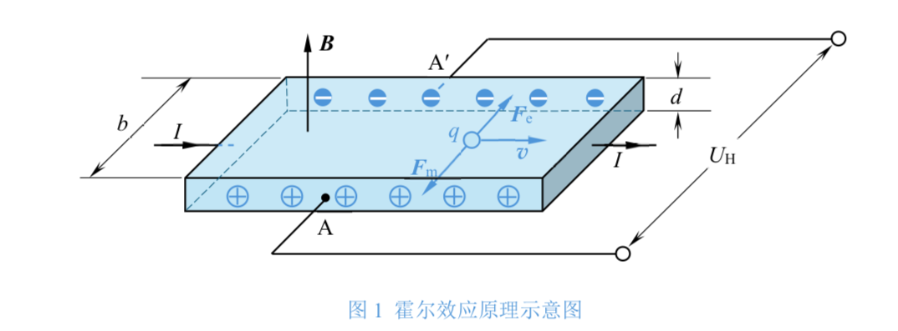
图1

### （2）霍尔电压的灵敏度

霍尔元件的灵敏度K~H~= 1/(nqd)，与载流子浓度和样品厚度成反比。半导体的载流子浓度远低于金属，因此使用薄型半导体霍尔元件能显著增强霍尔效应。

### （3）对称测量法求霍尔电压

实验中可能出现不等位电势差和热电、热磁副效应（如厄廷好森效应、能斯脱效应、里纪-勒杜克效应）。通过"对称测量法"，即反转磁场或电流方向取平均，可有效消除这些干扰，提高测量精度。具体方法是通过改变I~S~和B的方向测4次电压（+I~M~、+I~S~，+I~M~、-I~S~，-I~M~、-I~S~，-I~M~、+I~S~，I~M~为励磁电流）,分别记为U~1~、U~2~、U~3~、U~4~，综合考虑四种效应的影响：

U~AA'~=U~H~ +U~O~+U~E~ +U~N~+U~RL~

通过四次测量可消除U~O~、U~N~、U~RL~的影响：

U~H~ = (-U~1~ + U~2~ - U~3~ + U~4~)/4

若U~E~很小，可近似：

U~H~≈ (-U~1~ + U~2~ - U~3~ + U~4~)/4

### （4）电导率与载流子参数计算

电导率σ：由电极间的电压U~AC~和I~S~计算：

σ=I~S~L/U~AC~S（L为A、C间距，S=bd为霍尔片横截面积，b为宽度）

霍尔系数R~H~：R~H~=K~H~d

载流子浓度n: n=1/eR~H~（e=1.602×10^−19^C）

通过测量霍尔系数和电导率，可以计算出迁移率。载流子迁移率μ与电导率σ的关系为

σ = neμ

## 实验内容

### （1）确定霍尔片的载流子类型

根据霍尔片上的连接方式、电流源的流向、电磁铁的绕向以及电压表的连接方向，然后依据霍尔电压的正负来判断n型霍尔片和p型霍尔片。

### （2）测量p型霍尔片的灵敏度

保持工作电流 Is = 2.00 mA，励磁电流 I~M~取值 0.200 A ~ 0.700 A，用对称测量法测量 p 型霍尔片的霍尔电压，绘制并分析U~H~ --- I~M~曲线，用图解法求灵敏度K~H~值。

### （3）测量 p型半导体的电导率，计算霍尔系数、载流子浓度及载流子迁移率

在零磁场条件下，通以合适的工作电流 Is（Is≤0.20 mA）测量 UAC，结合中霍尔片的相关参数，计算本实验中用于制作 p 型霍尔片的半导体材料的电导率σ．计算该半导体的霍尔系数 RH、载流子浓度 n 和载流子迁移率μ。

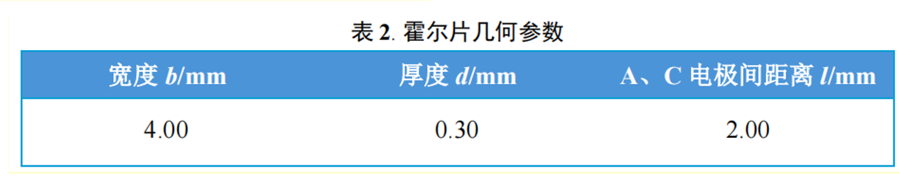

图2

### （4）测量 n型半导体的霍尔系数、载流子浓度及载流子迁移率

按照以上的步骤，选择合适的工作电流和励磁电流，测量 n 型半导体的霍尔系数 R~H~、载流子浓度 n 和载流子迁移率 μ，并和 p 型半导体进行比较。

### （5）利用霍尔效应测量磁场

系统可配合SPARKvue APP进行数字化采集与实时曲线绘制，支持导出 CSV 或 SPKL 文件格式，以便进一步数据分析。

采用数字化方式测量单线圈、不同距离下双线圈轴线上磁场分布情况(时间充足时也可探究更多不同线圈位置下磁场分布情况)，请保证支架处在0 cm时，霍尔探头刚好在线圈中心位置。将采集到的数据导出后进行处理，尝试用matlab或origin等软件在同一坐标系下作出单线圈、不同距离下双线圈的磁场强度位置图。

# 实验仪器

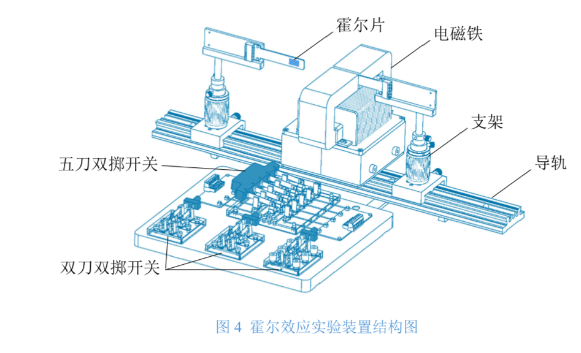

图3

### 1、电磁铁

用于产生实验所需的磁场。电磁铁的励磁电流I~M~由测试仪提供，铁芯气隙中心区域的磁感应强度 B 与I~M~在一定范围内呈线性关系，可引入电磁铁常数 C，即

B=CI~M~

不同实验仪的电磁铁常数略有差异，具体数值标示在线圈外壳上。

### 2、霍尔片与支架

实验中分别使用p型与n型半导体霍尔片，两者几何尺寸相同。霍尔片通常采用薄型半导体材料，以获得较大的霍尔电压信号，其尺寸为：

宽度 b = 4.00 mm，厚度 d = 0.30 mm，电极间距 l = 2.00 mm。

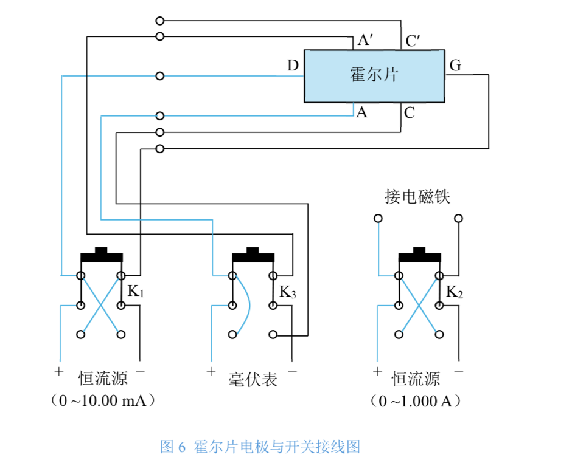

图4

### 3、开关与接线装置

该系统包含一个五刀双掷开关与三个双刀双掷开关。

五刀双掷开关：用于选择接入电路的霍尔片（p型或n型）。

K₁：K1向上扳时，恒流源输出的电流由D端流进，向下扳时，则由G端流进。

K₂：控制励磁电流方向，K2向上扳时，I~M~的流向与线圈相同，反之相反。线圈的绕向标示在电磁铁上。

K₃：切换电压测量模式，K3向上扳时，毫伏表测量U~AA'~，向下扳时测量U~AC~。

该设计能够快速切换测量参数，实现"对称测量法"以消除副效应带来的误差。

### 4、霍尔效应测试仪

该装置为实验核心设备，用于提供电源、测量与数据输出。其主要部分包括：

电源开关:用于开启或关闭整机；

数字接口：连接计算机或数据采集系统；

电压表：实时显示霍尔电压或电导电压；

工作电流旋钮：为霍尔元件提供恒定电流；

励磁电流旋钮：为线圈提供励磁电流，顺时针调大、逆时针调小；

注意：切换电流方向或插拔导线前，须将旋钮调至零位，以防突变电流损坏元件。

### 5、测量与辅助装置

实验装置配备精密导轨，可调整霍尔片在磁场中的具体位置，确保测量区域磁场均匀。电压采用毫伏表测量，以保证对微小电压信号的高精度读取。此外，系统可配合 SPARKvue APP 进行数字化采集与实时曲线绘制，支持导出 CSV 或 SPKL 文件格式，以便进一步数据分析。

整个霍尔效应实验仪器结构完善，功能集成度高。开关系统与数字化采集技术的结合，不仅提高了实验精度，也为霍尔效应研究提供了便捷的操作平台。

# 数据与分析

## 1. 载流子类型判断

实验中，控制工作电流流向与磁场方向一定，左侧霍尔片测得的 U~AA'~> 0，说明载流子为正电荷（空穴），属于p型半导体；右侧霍尔片测得的 U~AA'~< 0，说明载流子为负电荷（电子），属于n型半导体。

该结果与理论一致，验证了霍尔电压符号与载流子类型的对应关系。

## 2、测量p型霍尔片的灵敏度

### 法一：使用霍尔电压和磁场大小的关系

**表1 用对称测量法测p型霍尔片的霍尔电压**

工作电流 Is = 2.00 mA；电磁铁常数 C = 465mT/A；室温 t = 23.3°C

| IM/A | UAA'/mV (+IM、+IS) | UAA'/mV (-IM、+IS) | UAA'/mV (+IM、-IS) | UAA'/mV (-IS，-IM) | UH/mV |
|------|-------------------|-------------------|-------------------|-------------------|-------|
| 0.200 | 0.78 | -0.47 | -0.68 | 0.56 | 0.622 |
| 0.300 | 1.10 | -0.78 | -0.99 | 0.87 | 0.935 |
| 0.400 | 1.41 | -1.08 | -1.29 | 1.19 | 1.243 |
| 0.500 | 1.71 | -1.40 | -1.61 | 1.50 | 1.555 |
| 0.600 | 2.02 | -1.70 | -1.92 | 1.81 | 1.863 |
| 0.700 | 2.33 | -2.02 | -2.22 | 2.11 | 2.170 |

注：测量时，IM 应单向调节，减小磁滞效应的影响。

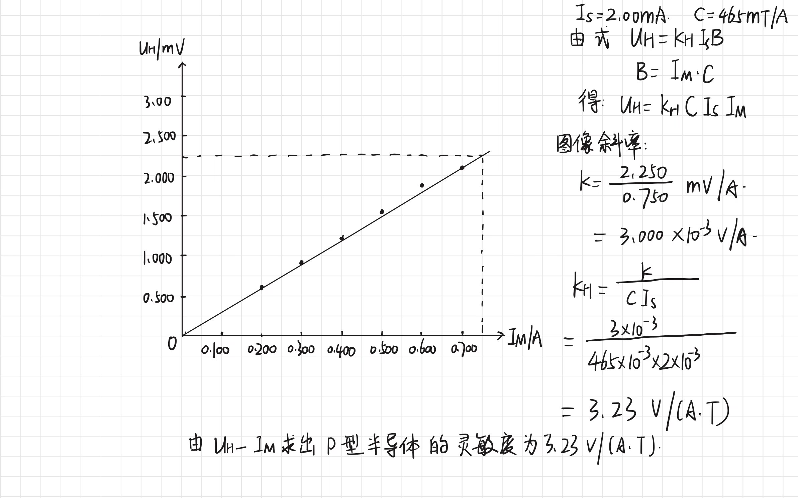

数据分析1

根据图像得知：所测量得到的霍尔电压灵敏度K~H~=3.23 **V**/($A \cdot T$)

### 法二：使用霍尔电压和工作电流的关系

**表2 用对称测量法测p型霍尔片的霍尔电压**

IM=0.7A；Is从1.00A到2.00A变化；电磁铁常数 C = 465mT/A；室温 t = 23.3°C

| Is/mA | UAA'/mV (+IM、+IS) | UAA'/mV (-IM、+IS) | UAA'/mV (+IM、-IS) | UAA'/mV (-IS，-IM) | UH/mV |
|-------|-------------------|-------------------|-------------------|-------------------|-------|
| 1.00 | 1.21 | -1.09 | 1.11 | -0.99 | 1.100 |
| 1.20 | 1.44 | -1.32 | 1.31 | -1.19 | 1.315 |
| 1.40 | 1.67 | -1.54 | 1.52 | -1.40 | 1.533 |
| 1.60 | 1.90 | -1.78 | 1.73 | -1.61 | 1.755 |
| 1.80 | 2.13 | -1.99 | 1.93 | -1.80 | 1.963 |
| 2.00 | 2.34 | -2.22 | 2.14 | -2.01 | 2.178 |

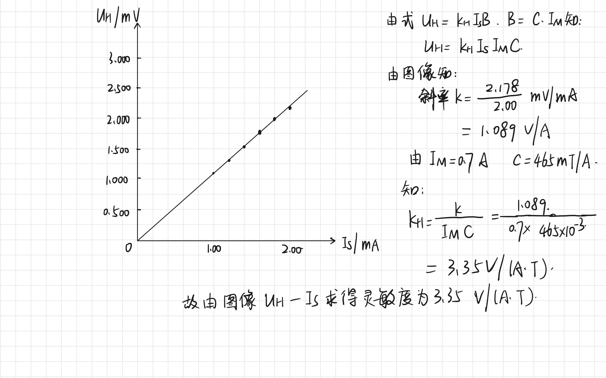

数据分析2

根据图像得知：所测量得到的霍尔电压灵敏度K~H~= 3.35 **V**/($A \cdot T$)

### 分析与比较：

两种方法均属于对称测量，但方法二（四组电流方向对称）在系统误差消除上更具优势，在霍尔效应测量中抑制系统误差效果更佳显著；方法一的"数据对称"（拟合UH-IM）虽能体现线性关系，但受磁场线性度和Is稳定性影响更大，误差相对偏高。

## 3.测量p型半导体的电导率，计算霍尔系数、载流子浓度及载流子迁移率

**表3 测量p型半导体的电导率**

IM=0;室温 t = 23.3°C

| Is/mA | 0 | 0.05 | 0.10 | 0.15 | 0.20 |
|-------|---|------|------|------|------|
| UAC/mV | 0.06 | 2.96 | 5.99 | 8.86 | 12.43 |

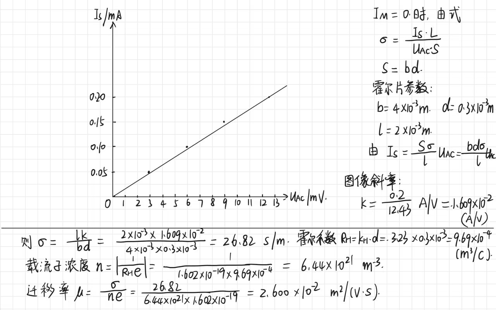

数据分析3

根据以上分析总结如下：

P型半导体霍尔片电导率为26.82 S/m

霍尔系数R~H~=3.23×10^-4^ m^3^/C

载流子浓度n=6.44×10^21^ m^-3^

载流子迁移率μ=2.600×10^-2^ **m^2^**/($V \cdot S$)

## 4.测量n型半导体的霍尔系数、载流子浓度及载流子迁移速度

**表4 用对称测量法测n型霍尔片的霍尔电压**

IM=0.7A；Is从1.00A到2.00A变化；电磁铁常数 C = 465mT/A；室温 t = 23.3°C

| Is/mA | UAA'/mV (+IM、+IS) | UAA'/mV (-IM、+IS) | UAA'/mV (+IM、-IS) | UAA'/mV (-IS，-IM) | UH/mV |
|-------|-------------------|-------------------|-------------------|-------------------|-------|
| 1.00 | -3.73 | 3.85 | -3.35 | 3.49 | -3.605 |
| 1.20 | -4.45 | 4.59 | -4.01 | 4.15 | -4.300 |
| 1.40 | -5.18 | 5.31 | -4.68 | 4.80 | -4.993 |
| 1.60 | -5.95 | 6.08 | -5.37 | 5.51 | -5.728 |
| 1.80 | -6.68 | 6.80 | -6.01 | 6.14 | -6.408 |
| 2.00 | -7.14 | 7.55 | -6.69 | 6.82 | -7.118 |

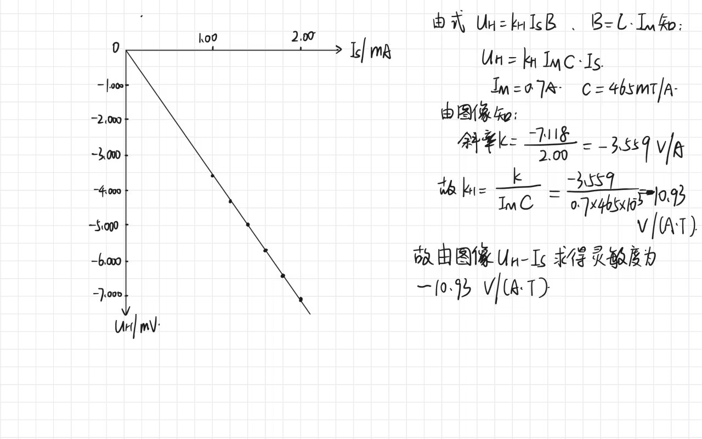

数据分析4

由图像可知：n型半导体霍尔片的霍尔电压灵敏度为-10.93 **V**/($A \cdot T$)

**表5 测量n型半导体的电导率**

IM=0;室温 t = 23.3°C

| Is/mA | 0 | 0.05 | 0.10 | 0.15 | 0.20 |
|-------|---|------|------|------|------|
| UAC/mV | 0.06 | 3.10 | 5.80 | 8.78 | 12.11 |

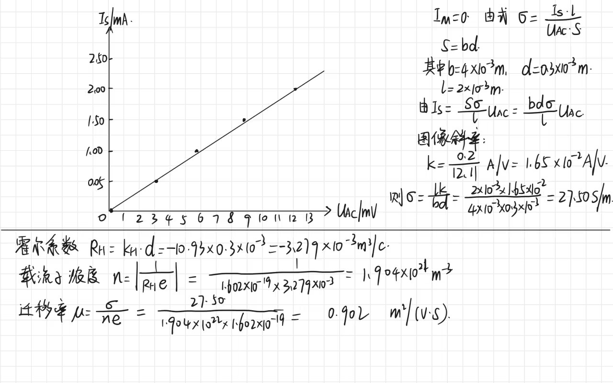

数据分析5

根据以上分析总结如下：

n型半导体霍尔片电导率为27.50 S/m

霍尔系数R~H~=-3.279×10^-4^ m^3^/C

载流子浓度n=1.904×10^21^ m^-3^

载流子迁移率μ=0.902 **m^2^**/($V \cdot S$)

## 思考问题：为什么测量之前要先测一组Is置零的情况？

在测量 n 型半导体电导率时，测"置零组Is=0时的UAC）"的核心目的是消除零位误差，具体原因如下：当 Is=0时，理论上半导体中无工作电流，对应的电压UAC应严格为 0。但实际中，由于以下因素会产生 "零位电压"：

（1）霍尔片不等势误差：霍尔片的电极制作不可能完全对称，无电流、无磁场下电极间也会因接触电阻、几何不对称存在微小电压。

（2）仪器零点漂移：电压表、电流源等仪器本身存在固有偏移，导致 "零输入" 时仍有输出读数。

所以在后续计算电导率时，需将每个Is对应的UAC减去置零组的UAC，得到修正后的电压UAC'= UAC - 0.06mV)，以此消除零位误差对线性关系和电导率计算的干扰。

## 5.利用霍尔效应测磁场

工作电流Is=5mA;励磁电流IM=0.5A;霍尔元件灵敏度K~H~=2316 **V**/($A \cdot T$)。

改变线圈之间的长度为R/2、R、2R，软件读取函数如下图：

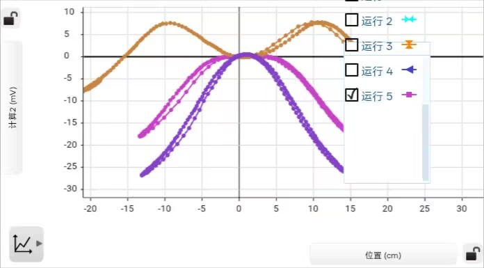

图5

# 四、实验小结

本实验我通过对霍尔效应的系统研究，掌握了霍尔电压的测量方法、载流子类型的判断依据，以及半导体材料电导率、霍尔系数、载流子浓度和迁移率的计算方法。

## 实验结果表明：

1. 通过霍尔电压的正负成功判断出p型与n型半导体，符合理论预期。
2. 采用对称测量法有效消除了不等位电势和热磁副效应的影响，提高了测量精度。
3. 测得p型霍尔片的灵敏度约为3.23～3.35 V/(A·T)，n型霍尔片的灵敏度约为10.93 V/(A·T)，两者差异反映了载流子类型与浓度对霍尔效应的影响。
4. p型与n型半导体的载流子迁移率分别为0.026 m²/(V·s)和0.902 m²/(V·s)，n型迁移率显著高于p型，说明电子为主要载流子时具有更高的运动能力。
5. 载流子浓度与迁移率的数值在常见半导体参杂迁移率范围内合理；所测得的霍尔电压存在正负号，表示空穴/电流方向与所定义正方向之间的关系。

## 实验中存在的主要误差来源包括：

1. 霍尔灵敏度与电压测量中的不确定度；
2. 电磁铁磁场的非线性与磁滞效应；
3. 环境温度波动对半导体性能的影响。

## 为提升实验精度，我的反思与改进：

1. 在测量前充分预热仪器，减少零点漂移；
2. 多次测量取平均值，尤其在切换电流与磁场方向时；
3. 对温度敏感的参数进行实时记录与修正。

本次实验深化了我对霍尔效应物理机制的理解，也锻炼了综合运用图解法与数值法处理实验数据的能力。

# 五、附录

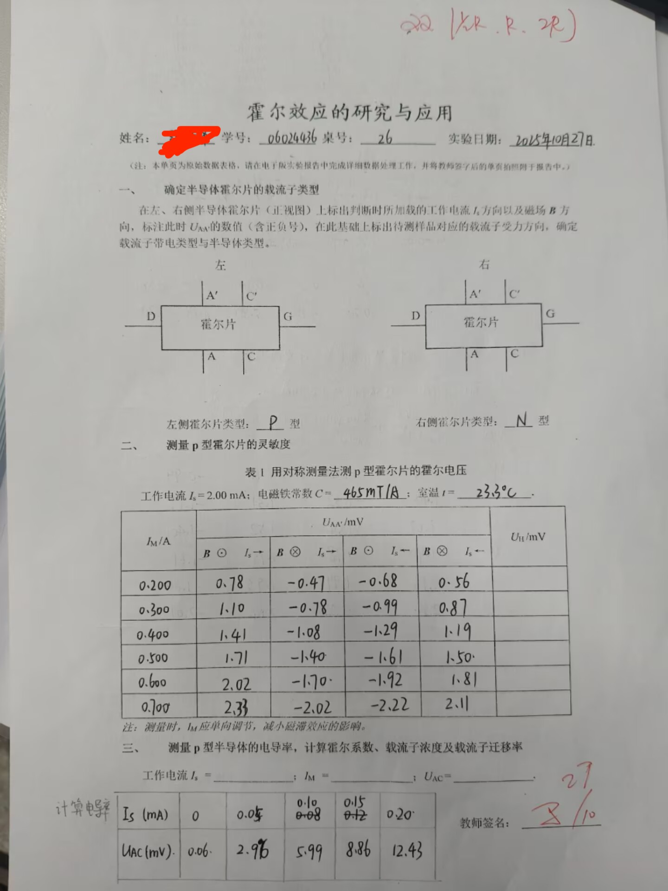

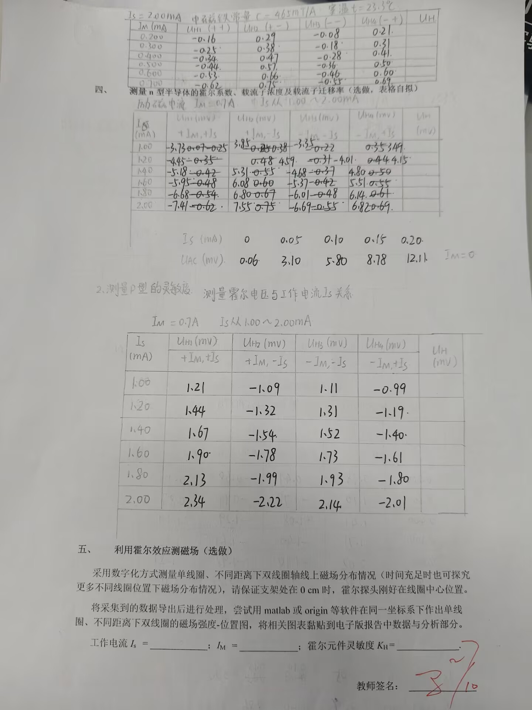